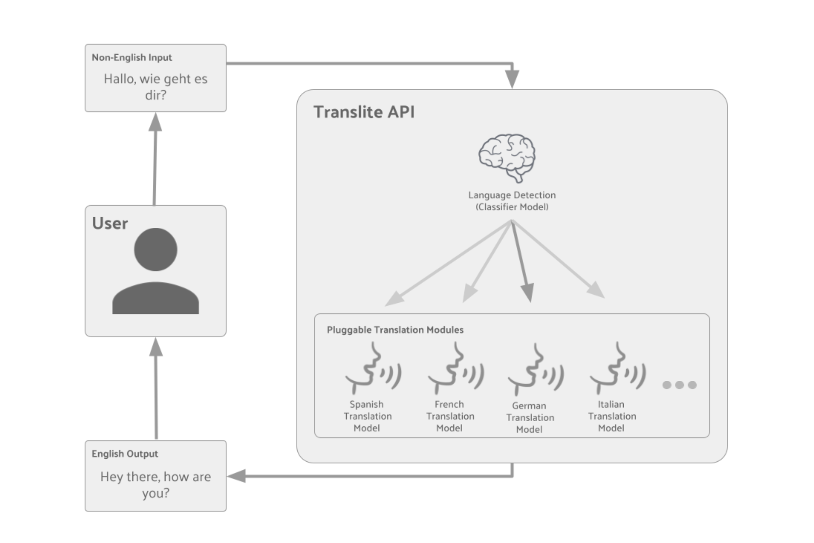

## Description
We propose to design Translite, a lightweight, modular, multilingual translation program intended for
small-scale applications with low resource availability like IoT systems since that is where our world is
heading. The system begins with a language classifier using TF-IDF Vectorization and a Multinomial Naive Bayes classifier to identify the source language. Then it dynamically loads a corresponding translation
model into RAM (rather than vRAM), reducing memory requirements and enhancing portability.
The structured translation process is:
User Input > Language Classification > Translation Model Selection > Translation to Language Output.
The modular design supports user-specific language selection and enables model customization using a
training script. The project uses publicly available translation datasets from Kaggle (e.g., English-French
dataset).

## Setup
### System Requirements
* 400MB RAM (Default, expands as you add more language models)
* Python >=3.9
* 4GB vRAM (Training on defaults, not necessary but expands as you add more language models)

### Startup
#### Linux
1. Open a terminal in the Translite directory
2. Run the command `./run`
#### Windows
1. Run `run.bat`

### Accessing
Visit http://127.0.0.1:5000/ in a web browser to access the Translite application. The default trained models are available in French, Spanish, and German. To add languages and/or train new ones either start a Jupyter server and load Translite.ipynb, or load it into Google Colab. Training defaults require ~4GB of vRAM available. The Notebook is verbose and will walk you through step by step on every step of the training process to make it as easy as possible.

## Architecture

Our back end architecture can be structured as a four step process. User input, language detection, translation models, and finally the outputted translation. The user will enter text into the frontend interface, in any supported language, the user is not required to select a language prior to their input. For language detection, an Naive Bayes-based classifier will be used to identify the input language. The classifier will be trained using a labeled dataset and multiple languages as examples. In order to align with our project goal of low resource usage, the model will be designed to be lightweight to avoid taking up to many resources. A language ID will also be assigned to any inputs to ensure that they receive the correct translation. Once the input language is properly detected, a specific translation model will be loaded into RAM. Each language has its own GRU based Seq2Seq translation model with Bandhau Attention, which are all trained from their corresponding datasets. Finally, regarding the output, the selected model will translate the user input into the target language of the user. The translation is then returned to the front end, where the translated text is displayed with the detected language.